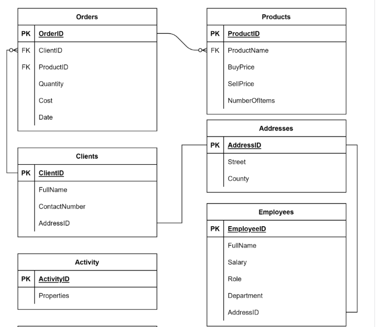
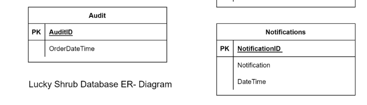

## Conduct a data analysis for a client persona
#### **Scenario**
The Lucky Shrub database contains a lot of data about their business. The data is increasing continuously. This database consists of many tables including 
* Clients, Orders, Products,  Addresses, Employees, Audit, Notifications and Activity as shown in the following ER-Diagram

`ERD`



<br>

#### **Environment Creation**
```sql
CREATE DATABASE IF NOT EXISTS Lucky_Shrub; 

USE Lucky_Shrub; 
 
CREATE TABLE Clients (ClientID VARCHAR(10) primary key, FullName VARCHAR(100), ContactNumber INT, AddressID INT); 
  
CREATE TABLE Products (ProductID VARCHAR(10) primary key, ProductName VARCHAR(100), BuyPrice DECIMAL(6,2), SellPrice DECIMAL(6,2), NumberOfItems INT);  
  
Create table Addresses(AddressID INT PRIMARY KEY, Street VARCHAR(255), County VARCHAR(100)); 
  
CREATE TABLE Employees (EmployeeID INT primary key, FullName VARCHAR(100), JobTitle VARCHAR(50), Department VARCHAR(200), AddressID INT);  
  
CREATE TABLE Activity( ActivityID INT PRIMARY KEY, Properties JSON ); 
  
CREATE TABLE Audit(AuditID INT AUTO_INCREMENT PRIMARY KEY, OrderDateTime TIMESTAMP NOT NULL  );  
  
CREATE TABLE Orders (OrderID INT NOT NULL PRIMARY KEY,  
ClientID VARCHAR(10), ProductID VARCHAR(10), Quantity INT, Cost DECIMAL(6,2), Date DATE,  
FOREIGN KEY (ClientID) REFERENCES Clients(ClientID), 
FOREIGN KEY (ProductID) REFERENCES Products(ProductID)); 
  
CREATE TABLE Notifications (NotificationID INT AUTO_INCREMENT PRIMARY KEY, Notification VARCHAR(256), DateTime TIMESTAMP NOT NULL); 
 
INSERT INTO Employees (EmployeeID, FullName, JobTitle, Department, AddressID) VALUES    
  
(1, "Seamus Hogan", "Manager", "Management", 7),    
  
(2, "Thomas Eriksson", "Assistant ", "Sales", 8),   
  
(3, "Simon Tolo", "Head Chef", "Management", 9),   
  
(4, "Francesca Soffia", "Assistant  ", "Human Resources", 10),   
  
(5, "Emily Sierra", "Accountant", "Finance", 11),    
  
(6, "Greta Galkina", "Accountant", "Finance", 12);  
  
  
  
INSERT INTO Activity(ActivityID, Properties) VALUES   
  
(1, '{ "ClientID": "Cl1", "ProductID": "P1", "Order": "True" }' ),   
  
(2, '{ "ClientID": "Cl2", "ProductID": "P4", "Order": "False" }' ),   
  
(3, '{ "ClientID": "Cl5", "ProductID": "P5", "Order": "True" }' ); 
  
  
  
INSERT INTO Clients(ClientID, FullName, ContactNumber, AddressID) VALUES   
  
("Cl1", "Takashi Ito", 351786345, 1),   
  
("Cl2", "Jane Murphy", 351567243, 2),   
  
("Cl3", "Laurina Delgado", 351342597, 3),   
  
("Cl4", "Benjamin Clauss", 351342509, 4),   
  
("Cl5", "Altay Ayhan", 351208983, 5),   
  
("Cl6", "Greta Galkina", 351298755, 6);     
  
  
INSERT INTO Products (ProductID, ProductName, BuyPrice, SellPrice, NumberOfITems) VALUES   
  
("P1", "Artificial grass bags ", 40, 50, 100),   
  
("P2", "Wood panels", 15, 20, 250),   
  
("P3", "Patio slates", 35, 40, 60),   
  
("P4", "Sycamore trees ", 7, 10, 50),   
  
("P5", "Trees and Shrubs", 35, 50, 75),   
  
("P6", "Water fountain", 65, 80, 15); 
  
  
  
INSERT INTO Addresses(AddressID, Street, County) VALUES   
  
(1, ",291 Oak Wood Avenue", "Graham County"),   
  
(2, "724 Greenway Drive", "Pinal County"),   
  
(3, "102 Sycamore Lane", "Santa Cruz County"),   
  
(4, "125 Roselawn Close", "Gila County"),   
  
(5, "831 Beechwood Terrace", "Cochise County"),  
  
(6, "755 Palm Tree Hills", "Mohave County"),   
  
(7, "751 Waterfall Hills", "Tuscon County") ,   
  
(8, "878 Riverside Lane", "Tuscon County") ,   
  
(9, "908 Seaview Hills", "Tuscon County"),   
  
(10, "243 Waterview Terrace", "Tuscon County"),   
  
(11, "148 Riverview Lane", "Tuscon County"),    
  
(12, "178 Seaview Avenue", "Tuscon County");  
  
  
INSERT INTO Orders (OrderID, ClientID, ProductID , Quantity, Cost, Date) VALUES   
  
(1, "Cl1", "P1", 10, 500, "2020-09-01" ),   
  
(2, "Cl2", "P2", 5, 100, "2020-09-05"),   
  
(3, "Cl3", "P3", 20, 800, "2020-09-03"),   
  
(4, "Cl4", "P4", 15, 150, "2020-09-07"),   
  
(5, "Cl3", "P3", 10, 450, "2020-09-08"),   
  
(6, "Cl2", "P2", 5, 800, "2020-09-09"),   
  
(7, "Cl1", "P4", 22, 1200, "2020-09-10"),   
  
(8, "Cl3", "P1", 15, 150, "2020-09-10"),   
  
(9, "Cl1", "P1", 10, 500, "2020-09-12"),   
  
(10, "Cl2", "P2", 5, 100, "2020-09-13"),   
  
(11, "Cl4", "P5", 5, 100, "2020-09-15"),  
  
(12, "Cl1", "P1", 10, 500, "2022-09-01" ),   
  
(13, "Cl2", "P2", 5, 100, "2022-09-05"),   
  
(14, "Cl3", "P3", 20, 800, "2022-09-03"),   
  
(15, "Cl4", "P4", 15, 150, "2022-09-07"),   
  
(16, "Cl3", "P3", 10, 450, "2022-09-08"),   
  
(17, "Cl2", "P2", 5, 800, "2022-09-09"),   
  
(18, "Cl1", "P4", 22, 1200, "2022-09-10"),   
  
(19, "Cl3", "P1", 15, 150, "2022-09-10"),   
  
(20, "Cl1", "P1", 10, 500, "2022-09-12"),   
  
(21, "Cl2", "P2", 5, 100, "2022-09-13"),    
  
(22, "Cl2", "P1", 10, 500, "2021-09-01" ),   
  
(23, "Cl2", "P2", 5, 100, "2021-09-05"),   
  
(24, "Cl3", "P3", 20, 800, "2021-09-03"),   
  
(25, "Cl4", "P4", 15, 150, "2021-09-07"),   
  
(26, "Cl1", "P3", 10, 450, "2021-09-08"),   
  
(27, "Cl2", "P1", 20, 1000, "2022-09-01" ),   
  
(28, "Cl2", "P2", 10, 200, "2022-09-05"),   
  
(29, "Cl3", "P3", 20, 800, "2021-09-03"),   
  
(30, "Cl1", "P1", 10, 500, "2022-09-01" ); 
```

---

<br>

### **Tasks**
**1.** Lucky Shrub need to find out what their `average sale price`, or cost was for a product in 2022. You can help them with this task by creating a **FindAverageCost() function** that returns the average sale price value of all products in a specific year. 
* This should be based on the user input.
```sql
CREATE FUNCTION IF NOT EXISTS FindAverageCost(input_year INT)
RETURNS DECIMAL(10,2) DETERMINISTIC 
RETURN (
    SELECT 
        ROUND(AVG(Cost), 2)
    FROM Orders
    WHERE YEAR(Date) = input_year
);

SELECT FindAverageCost(2022);
```
| FindAverageCost(2022) |
|-----------------------|
|                496.15 |

<br>

**2.** Lucky Shrub need to evaluate the sales patterns for bags of artificial grass over the last three years. Help them out using the following steps:
* Step 1: Create the EvaluateProduct stored procedure that outputs the total number of items sold during the last three years for the P1 Product ID. Input the ProductID when invoking the procedure.
* Step 2: Call the procedure.
* Step 3: Output the values into outside variables.
```sql
DELIMITER //
-- Declare which of the procedure parameters are input against output
CREATE PROCEDURE EvaluateProduct(IN product_ID VARCHAR(10), OUT sold_items2020 INT, OUT sold_items2021 INT, OUT sold_items2022 INT)
    BEGIN
    SELECT SUM(Quantity) INTO sold_items2020 FROM Orders WHERE YEAR(Date) = 2020 AND ProductID = product_ID;
    SELECT SUM(Quantity) INTO sold_items2021 FROM Orders WHERE YEAR(Date) = 2021 AND ProductID = product_ID;
    SELECT SUM(Quantity) INTO sold_items2022 FROM Orders WHERE YEAR(Date) = 2022 AND ProductID = product_ID;
END //
DELIMITER ; -- Change to default delimiters

-- Now We Want to call and assign the output to variables using the : @syntax (binds in a sense) and then we can select those variables
CALL EvaluateProduct('P1', @sold_items2020, @sold_itmes2021, @sold_items2022);

-- Now Select new variables holding output from called procedure
SELECT @sold_items2020, @sold_itmes2021, @sold_items2022;
```
| @sold_items2020 | @sold_itmes2021 | @sold_items2022 |
|-----------------|-----------------|-----------------|
|              35 |              10 |              65 |

<br>

**3.** Lucky Shrub need to automate the orders process in their database. The database must insert a new record of data in response to the insertion of a new order in the Orders table. This new record of data must contain a new ID and the current date and time.

You can help Lucky Shrub by creating a trigger called `UpdateAudit`. This trigger must be invoked automatically AFTER a new order is inserted into the Orders table.

```sql
DELIMITER //
CREATE TRIGGER IF NOT EXISTS UpdateAudit
    AFTER INSERT
    ON Orders FOR EACH ROW
    INSERT INTO Audit (OrderDateTime)
    -- VALUES(Current_timestamp)
    VALUES(CURRENT_TIME());
//
-- CHANGE BACK
DELIMITER ;

-- Demo Insert into orders then check audit
INSERT INTO Orders VALUES
(31, "Cl1", "P1", 10, 500, "2022-09-01" );

-- Audit
 SELECT * FROM Audit;
```
| AuditID | OrderDateTime       |
|---------|---------------------|
|       1 | 2023-07-03 15:44:49 |

```sql
-- Will Delete the inserted order row above which confrmed the trigger 
DELETE FROM Orders WHERE OrderID = 31;
```

<br>

**4.** Lucky Shrub need location data for their clients and employees. To help them out, create an optimized query that outputs the following data:

* The full name of all clients and employees from the Clients and Employees tables in the Lucky Shrub database.

* The address of each person from the Addresses table.

```sql
-- Let's use a union (left join for all employees and clients and any found addresses)
SELECT e.FullName, adr.Street, adr.County
FROM Employees AS e
LEFT JOIN Addresses AS adr
USING(AddressID)
UNION
SELECT c.FullName, adr.Street, adr.County
FROM Clients AS c
LEFT JOIN Addresses AS adr
USING(AddressID)
ORDER BY Street;
```
| FullName         | Street                | County            |
|------------------|-----------------------|-------------------|
| Laurina Delgado  | 102 Sycamore Lane     | Santa Cruz County |
| Benjamin Clauss  | 125 Roselawn Close    | Gila County       |
| Emily Sierra     | 148 Riverview Lane    | Tuscon County     |
| Greta Galkina    | 178 Seaview Avenue    | Tuscon County     |
| Francesca Soffia | 243 Waterview Terrace | Tuscon County     |
| Takashi Ito      | 291 Oak Wood Avenue   | Graham County     |
| Jane Murphy      | 724 Greenway Drive    | Pinal County      |
| Seamus Hogan     | 751 Waterfall Hills   | Tuscon County     |
| Greta Galkina    | 755 Palm Tree Hills   | Mohave County     |
| Altay Ayhan      | 831 Beechwood Terrace | Cochise County    |
| Thomas Eriksson  | 878 Riverside Lane    | Tuscon County     |
| Simon Tolo       | 908 Seaview Hills     | Tuscon County     |

<br>

**5.** Lucky Shrub need to find out what quantities of wood panels they are selling. The wood panels product has a Product ID of P2. The following query returns the total quantity of this product as sold in the years 2020, 2021 and 2022
```sql
SELECT CONCAT(SUM(Cost), ' for the year : 2020') AS 'Total sum of P2 Product'
FROM Orders WHERE YEAR(Date) = 2020 AND ProductID = 'P2'
UNION
SELECT CONCAT(SUM(Cost), ' for the year : 2021')
FROM Orders WHERE YEAR(Date) = 2021 AND ProductID = 'P2'
UNION
SELECT CONCAT(SUM(Cost), ' for the year : 2022')
FROM Orders WHERE YEAR(Date) = 2022 AND ProductID = 'P2';
```
| Total sum of P2 Product     |
|-----------------------------|
| 1000.00 for the year : 2020 |
| 100.00 for the year : 2021  |
| 1200.00 for the year : 2022 |

<br>

**6.** Lucky Shrub want to know more about the activities of the clients who use their online store. The system logs the ClientID and the ProductID information for each activity in a JSON Properties column inside the Activity table. This occurs while clients browse through Lucky Shrub products online. The following screenshot shows the Activity table.

#### Utilize the Properties data to output the following information:
* The full name and contact number of each client from the Clients table.
* The ProductID for all clients who performed activities.

```sql
SELECT 
    a.Properties->'$.ClientID' AS ClientID,
    a.Properties ->> '$.ProductID' AS ProductID,
    c.FullName, c.ContactNumber 
FROM Clients as c RIGHT JOIN Activity as a
ON c.ClientID = a.properties ->>'$.ClientID';

-- Another way
SELECT Activity.Properties ->>'$.ClientID' 
AS ClientID, Activity.Properties ->>'$.ProductID' 
AS ProductID, Clients.FullName, Clients.ContactNumber 
FROM Clients RIGHT JOIN Activity 
ON Clients.ClientID = Activity.Properties ->>'$.ClientID';
```
* First Table Output
| ClientID | ProductID | FullName    | ContactNumber |
|----------|-----------|-------------|---------------|
| "Cl1"    | P1        | Takashi Ito |     351786345 |
| "Cl2"    | P4        | Jane Murphy |     351567243 |
| "Cl5"    | P5        | Altay Ayhan |     351208983 |

* Second Table Output Notice how the ClientID differs with the quotation from above based on the double arrow `-->`
| ClientID | ProductID | FullName    | ContactNumber |
|----------|-----------|-------------|---------------|
| Cl1      | P1        | Takashi Ito |     351786345 |
| Cl2      | P4        | Jane Murphy |     351567243 |
| Cl5      | P5        | Altay Ayhan |     351208983 |


#### `Property Access Detail`
You can see the double quote on the ClientID value based on the access type, really important on **JOINS** that if you are matching you want to use the second (without double quotes) for values to match!

* Use the following code to access the property value with double quotations from the JSON datatype: ->'$.PropertyName

* Use the following code to access the property value without double quotations from the JSON datatype: ->>'$. PropertyName

<br>

**7.** Lucky Shrub need to find out how much revenue their top selling product generated. 
Create a `stored procedure` called `GetProfit` that returns the overall profits generated by a specific product in a specific year. This should be based on the user input of the ProductID and Year. 

* So we're gonna need to take some of the buy/sell price detail from products, and join onto orders 
```sql
WITH 2020_Orders AS (
SELECT
    p.ProductID as product,
    YEAR(o.Date) AS sale_year,
    SUM(o.Quantity) as quantity_sold
FROM Products AS p
INNER JOIN Orders AS o
    USING(ProductID)
WHERE YEAR(o.Date) = 2020
GROUP BY product, sale_year
ORDER BY product
),
product_profits AS (
    SELECT
        first_cte.product,
        first_cte.sale_year,
        (first_cte.quantity_sold * p.SellPrice) - (first_cte.quantity_sold * p.BuyPrice) AS 2020_product_profit
    FROM 2020_Orders AS first_cte
    INNER JOIN Products AS p
        ON first_cte.product = p.ProductID
)
SELECT * 
FROM product_profits;
```
| product | sale_year | 2020_product_profit |
|---------|-----------|---------------------|
| P1      |      2020 |              350.00 |
| P2      |      2020 |               75.00 |
| P3      |      2020 |              150.00 |
| P4      |      2020 |              111.00 |
| P5      |      2020 |               75.00 |

* So we need to be able to take a provided product and return the profit column above
* We can have some more flexibility here however and use variables to hold values 

```sql
DELIMITER //
CREATE PROCEDURE GetProfit(IN product_id VARCHAR(5), IN input_year INT)
BEGIN
-- declare variables
DECLARE year_profit DECIMAL(6,2) DEFAULT 0.0;
-- We can also declare multiple values at once with the same data type and set a default of 0 
DECLARE buy_price, sell_price, sold_quantity INT DEFAULT 0;
SELECT BuyPrice INTO buy_price FROM Products WHERE ProductID = product_id;
SELECT SellPrice INTO sell_price FROM Products WHERE ProductID = product_id;
SELECT SUM(Quantity) INTO sold_quantity FROM Orders WHERE ProductID = product_id AND YEAR(Date) = input_year;
SET year_profit = (sell_price * sold_quantity) - (buy_price * sold_quantity);
SELECT year_profit;
END //
DELIMITER ;

-- Call
CALL GetProfit('P1', 2020);
CALL GetProfit('P2', 2021);
CALL GetProfit('P5', 2020);
CALL GetProfit('P3', 2020);

```
| year_profit |
|-------------|
|      350.00 |


| year_profit |
|-------------|
|       25.00 |

| year_profit |
|-------------|
|       75.00 |


| year_profit |
|-------------|
|      150.00 |

* Numbers are matching for our CTE type return and with the function/procedure that can be called

<br>

**8.** Lucky Shrub need a summary of their client's details, including their addresses, order details and the products they purchased. Help them out by creating a virtual table called `DataSummary` that joins together the four tables that contain this data. These four tables are as follows:
* Clients, Addresses, Orders, and Products.

#### **The virtual table must display the following data:**
* The full name and contact number for each client from the Clients table.
* The county that each client lives in from the Addresses table.
* The name of the product they purchased from the Products table.
* The ProductID, cost and date of each order from the Orders table.
* The virtual table should show relevant data for year 2022 only. Order the data by the cost of the highest order. 

```sql
CREATE VIEW DataSummary AS 
SELECT
    clts.FullName, clts.ContactNumber,
    adrs.County,
    prdcts.ProductName,
    ords.ProductID, ords.Cost, ords.Date
FROM Clients AS clts
INNER JOIN Addresses AS adrs
    ON clts.AddressID = adrs.AddressID
INNER JOIN Orders AS ords
    ON clts.ClientID = ords.ClientID
INNER JOIN Products AS prdcts
    ON ords.ProductID = prdcts.ProductID
WHERE YEAR(ords.Date) = 2022
ORDER BY ords.Cost DESC;

-- Now a Basic Select
SELECT * FROM DataSummary;
```
| FullName        | ContactNumber | County            | ProductName            | ProductID | Cost    | Date       |
|-----------------|---------------|-------------------|------------------------|-----------|---------|------------|
| Takashi Ito     |     351786345 | Graham County     | Sycamore trees         | P4        | 1200.00 | 2022-09-10 |
| Jane Murphy     |     351567243 | Pinal County      | Artificial grass bags  | P1        | 1000.00 | 2022-09-01 |
| Laurina Delgado |     351342597 | Santa Cruz County | Patio slates           | P3        |  800.00 | 2022-09-03 |
| Jane Murphy     |     351567243 | Pinal County      | Wood panels            | P2        |  800.00 | 2022-09-09 |
| Takashi Ito     |     351786345 | Graham County     | Artificial grass bags  | P1        |  500.00 | 2022-09-01 |
| Takashi Ito     |     351786345 | Graham County     | Artificial grass bags  | P1        |  500.00 | 2022-09-12 |
| Takashi Ito     |     351786345 | Graham County     | Artificial grass bags  | P1        |  500.00 | 2022-09-01 |
| Laurina Delgado |     351342597 | Santa Cruz County | Patio slates           | P3        |  450.00 | 2022-09-08 |
| Jane Murphy     |     351567243 | Pinal County      | Wood panels            | P2        |  200.00 | 2022-09-05 |
| Benjamin Clauss |     351342509 | Gila County       | Sycamore trees         | P4        |  150.00 | 2022-09-07 |
| Laurina Delgado |     351342597 | Santa Cruz County | Artificial grass bags  | P1        |  150.00 | 2022-09-10 |
| Jane Murphy     |     351567243 | Pinal County      | Wood panels            | P2        |  100.00 | 2022-09-05 |
| Jane Murphy     |     351567243 | Pinal County      | Wood panels            | P2        |  100.00 | 2022-09-13 |


