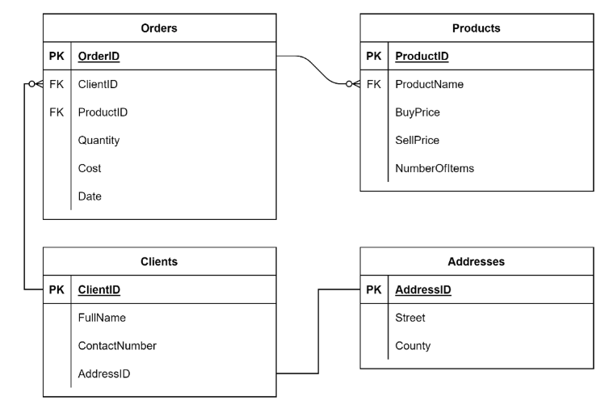

## Data analysis in MySQL
#### `Scenario`
Lucky Shrub needs to perform data analysis to develop insights into the performance and progress of the business. They can carry out this task by analyzing the data contained within the Clients, Orders, Products and Addresses tables within their database, as shown in the following ER-Diagram:



<br>

#### **Set-up**
* We'll have a little fun here and create the tables with constraints and alter statements as well as relevant key relationships from the provided ERD. Not sure of the Products FK value of ProductName as it isn't used nor does the relationship make sense
```sql
-- Create
CREATE DATABASE IF NOT EXISTS Lucky_Shrub;

-- Use
USE Lucky_Shrub;

-- Create Tables, initial tables without foreign key (Primary Key can't be null)
CREATE TABLE Addresses (AddressID INT PRIMARY KEY, Street VARCHAR(50) NOT NULL,
County VARCHAR(30));
-- Set Default Addresses
ALTER TABLE Addresses MODIFY Street VARCHAR(50) NOT NULL DEFAULT '123 Disney Way', MODIFY County VARCHAR(30) NOT NULL DEFAULT 'Bexar';
--  ALTER TABLE `emp` MODIFY COLUMN `id` INT NOT NULL UNIQUE AUTO_INCREMENT FIRST;

-- Create Client
CREATE TABLE Clients (ClientID INT PRIMARY KEY, FullName VARCHAR(40) NOT NULL,
ContactNumber INT NOT NULL, Address_ID INT NOT NULL, FOREIGN KEY (Address_ID) REFERENCES Addresses(AddressID));
-- ALTER Table for ClientID Primary KEY TYPE
ALTER TABLE Clients MODIFY ClientID VARCHAR(10) PRIMARY KEY;

-- Products
CREATE TABLE Products (ProductID VARCHAR(10) PRIMARY KEY, ProductName VARCHAR(100), BuyPrice DECIMAL(6,2), SellPrice DECIMAL(6,2), NumberOfItems INT); 

-- Orders
CREATE TABLE Orders (OrderID INT NOT NULL PRIMARY KEY, ClientID VARCHAR(10),  
ProductID VARCHAR(10),Quantity INT, Cost DECIMAL(6,2), Date DATE,
FOREIGN KEY (ClientID) REFERENCES Clients(ClientID), FOREIGN KEY (ProductID) REFERENCES Products(ProductID)); 
```
```sql
-- Insertions (Start with Address, Then Clients, Then Products and Finally Orders)
INSERT INTO Addresses (AddressID, Street, County) VALUES 
(1, ",291 Oak Wood Avenue", "Graham County"), 
(2, "724 Greenway Drive", "Pinal County"), 
(3, "102 Sycamore Lane", "Santa Cruz County"), 
(4, "125 Roselawn Close", "Gila County"), 
(5, "831 Beechwood Terrace", "Cochise County"),
(6, "755 Palm Tree Hills", "Mohave County"), 
(7, "751 Waterfall Hills", "Tucson County") , 
(8, "878 Riverside Lane", "Tucson County") , 
(9, "908 Seaview Hills", "Tucson County"), 
(10, "243 Waterview Terrace", "Tucson County"), 
(11, "148 Riverview Lane", "Tucson County"),  
(12, "178 Seaview Avenue", "Tucson County");


INSERT INTO Clients(ClientID, FullName, ContactNumber, Address_ID) VALUES 
("Cl1", "Takashi Ito", 351786345, 1), 
("Cl2", "Jane Murphy", 351567243, 2), 
("Cl3", "Laurina Delgado", 351342597, 3), 
("Cl4", "Benjamin Clauss", 351342509, 4), 
("Cl5", "Altay Ayhan", 351208983, 5), 
("Cl6", "Greta Galkina", 351298755, 6); 

INSERT INTO Products (ProductID, ProductName, BuyPrice, SellPrice, NumberOfItems) VALUES 
("P1", "Artificial grass bags ", 40, 50, 100), 
("P2", "Wood panels", 15, 20, 250), 
("P3", "Patio slates",  35, 40, 60), 
("P4", "Sycamore trees ", 7, 10, 50), 
("P5", "Trees and Shrubs", 35, 50, 75), 
("P6", "Water fountain", 65, 80, 15); 

INSERT INTO Orders (OrderID, ClientID, ProductID , Quantity, Cost, Date) VALUES 
(1, "Cl1", "P1", 10, 500, "2020-09-01" ), 
(2, "Cl2", "P2", 5, 100, "2020-09-05"), 
(3, "Cl3", "P3", 20, 800, "2020-09-03"), 
(4, "Cl4", "P4", 15, 150, "2020-09-07"), 
(5, "Cl3", "P3", 10, 450, "2020-09-08"), 
(6, "Cl2", "P2", 5, 800, "2020-09-09"), 
(7, "Cl1", "P4", 22, 1200, "2020-09-10"), 
(8, "Cl3", "P1", 15, 150, "2020-09-10"), 
(9, "Cl1", "P1", 10, 500, "2020-09-12"), 
(10, "Cl2", "P2", 5, 100, "2020-09-13"), 
(11, "Cl4", "P5", 5, 100, "2020-09-15"),
(12, "Cl1", "P1", 10, 500, "2022-09-01"), 
(13, "Cl2", "P2", 5, 100, "2022-09-05"), 
(14, "Cl3", "P3", 20, 800, "2022-09-03"), 
(15, "Cl4", "P4", 15, 150, "2022-09-07"), 
(16, "Cl3", "P3", 10, 450, "2022-09-08"), 
(17, "Cl2", "P2", 5, 800, "2022-09-09"), 
(18, "Cl1", "P4", 22, 1200, "2022-09-10"), 
(19, "Cl3", "P1", 15, 150, "2022-09-10"), 
(20, "Cl1", "P1", 10, 500, "2022-09-12"), 
(21, "Cl2", "P2", 5, 100, "2022-09-13"),  
(22, "Cl2", "P1", 10, 500, "2021-09-01"), 
(23, "Cl2", "P2", 5, 100, "2021-09-05"), 
(24, "Cl3", "P3", 20, 800, "2021-09-03"), 
(25, "Cl4", "P4", 15, 150, "2021-09-07"), 
(26, "Cl1", "P3", 10, 450, "2021-09-08"), 
(27, "Cl2", "P1", 20, 1000, "2022-09-01"), 
(28, "Cl2", "P2", 10, 200, "2022-09-05"), 
(29, "Cl3", "P3", 20, 800, "2021-09-03"), 
(30, "Cl1", "P1", 10, 500, "2022-09-01"); 
```
---

<br>

### **Tasks Instructions**
Lucky Shrub need to evaluate the performance of their business by performing data analysis on their database tables. See if you can help them by performing the following tasks.

**1.** Lucky Shrub need to find out how many sycamore trees they’ve sold over the past few years.
* Sycamore trees have been assigned an ID of `P4` in the products table in the database. 
* Create a query that returns the total quantity of all products with the ID of P4 sold in the years 2020, 2021 and 2022.

```sql
-- Multiple Group by Call
SELECT
    o.ProductID AS product_id,
    p.ProductName AS product_name,
    YEAR(o.Date) AS year_ordered,
    SUM(o.Quantity) AS Sycamore_Trees_Sold
FROM Orders AS o
INNER JOIN Products AS p
    USING(ProductID)
WHERE o.ProductID = 'P4'
GROUP BY product_id, product_name, year_ordered
ORDER BY year_ordered;
```
| product_id | product_name    | year_ordered | Sycamore_Trees_Sold |
|------------|-----------------|--------------|---------------------|
| P4         | Sycamore trees  |         2020 |                  37 |
| P4         | Sycamore trees  |         2021 |                  15 |
| P4         | Sycamore trees  |         2022 |                  37 |

* Another Way to get there with an aggregated 
```sql
SELECT CONCAT (SUM(Quantity), "(2020)") AS "P4 product: Quantity sold" FROM Orders WHERE YEAR (Date) = 2020 AND ProductID = "P4"
UNION 
SELECT CONCAT (SUM(Quantity), "(2021)") FROM Orders WHERE YEAR (Date) = 2021 AND ProductID = "P4"
UNION 
SELECT CONCAT (SUM(Quantity), "(2022)") FROM Orders WHERE YEAR (Date) = 2022 AND ProductID = "P4";
```
| P4 product: Quantity sold |
|---------------------------|
| 37(2020)                  |
| 15(2021)                  |
| 37(2022)                  |

<br>

**2.** Lucky Shrub need information on all their clients and the orders that they placed in the years 2022 and 2021. See if you can help them by extracting the required information from each of the following tables:

• Clients table: The client id and contact number for each client who placed an order

• Addresses table: The street and county for each client’s address

• Orders table: The order id, cost and date of each client’s order.

• Products table: The name of each product ordered.

```sql
-- Where for the year condition
SELECT 
    c.ClientID,
    c.ContactNumber,
    a.Street,
    a.County,
    o.OrderID,
    o.Cost,
    o.Date
FROM Clients AS c
INNER JOIN Addresses AS a
    ON c.Address_ID = a.AddressID
INNER JOIN Orders AS o
    ON c.ClientID = o.ClientID
INNER JOIN Products as p
    ON o.ProductID = p.ProductID
WHERE YEAR(o.DATE) in (2021, 2022)
ORDER BY ClientID, Date;

-- Another Way
SELECT Clients.ClientID, Clients.ContactNumber, Addresses.Street, Addresses.County,  Orders.OrderID, Orders.ProductID, Products.ProductName, Orders.Cost, Orders.Date 
FROM Clients 
INNER JOIN Addresses ON Clients.Address_ID = Addresses.AddressID 
INNER JOIN Orders ON Clients.ClientID = Orders.ClientID 
INNER JOIN Products ON Orders.ProductID = Products.ProductID 
WHERE YEAR (Orders.Date) = 2021 OR YEAR (Orders.Date) = 2022 ORDER BY Orders.Date;
```
| ClientID | ContactNumber | Street               | County            | OrderID | Cost    | Date       |
|----------|---------------|----------------------|-------------------|---------|---------|------------|
| Cl1      |     351786345 | ,291 Oak Wood Avenue | Graham County     |      26 |  450.00 | 2021-09-08 |
| Cl1      |     351786345 | ,291 Oak Wood Avenue | Graham County     |      12 |  500.00 | 2022-09-01 |
| Cl1      |     351786345 | ,291 Oak Wood Avenue | Graham County     |      30 |  500.00 | 2022-09-01 |
| Cl1      |     351786345 | ,291 Oak Wood Avenue | Graham County     |      18 | 1200.00 | 2022-09-10 |
| Cl1      |     351786345 | ,291 Oak Wood Avenue | Graham County     |      20 |  500.00 | 2022-09-12 |
| Cl2      |     351567243 | 724 Greenway Drive   | Pinal County      |      22 |  500.00 | 2021-09-01 |
| Cl2      |     351567243 | 724 Greenway Drive   | Pinal County      |      23 |  100.00 | 2021-09-05 |
| Cl2      |     351567243 | 724 Greenway Drive   | Pinal County      |      27 | 1000.00 | 2022-09-01 |
| Cl2      |     351567243 | 724 Greenway Drive   | Pinal County      |      13 |  100.00 | 2022-09-05 |
| Cl2      |     351567243 | 724 Greenway Drive   | Pinal County      |      28 |  200.00 | 2022-09-05 |
| Cl2      |     351567243 | 724 Greenway Drive   | Pinal County      |      17 |  800.00 | 2022-09-09 |
| Cl2      |     351567243 | 724 Greenway Drive   | Pinal County      |      21 |  100.00 | 2022-09-13 |
| Cl3      |     351342597 | 102 Sycamore Lane    | Santa Cruz County |      24 |  800.00 | 2021-09-03 |
| Cl3      |     351342597 | 102 Sycamore Lane    | Santa Cruz County |      29 |  800.00 | 2021-09-03 |
| Cl3      |     351342597 | 102 Sycamore Lane    | Santa Cruz County |      14 |  800.00 | 2022-09-03 |
| Cl3      |     351342597 | 102 Sycamore Lane    | Santa Cruz County |      16 |  450.00 | 2022-09-08 |
| Cl3      |     351342597 | 102 Sycamore Lane    | Santa Cruz County |      19 |  150.00 | 2022-09-10 |
| Cl4      |     351342509 | 125 Roselawn Close   | Gila County       |      25 |  150.00 | 2021-09-07 |
| Cl4      |     351342509 | 125 Roselawn Close   | Gila County       |      15 |  150.00 | 2022-09-07 |


<br>

**3.** Lucky Shrub needs to analyze the sales performance of their `Patio slates` product in the year `2021`. This product has a Product ID of P3. Help Lucky Shrub to analyze the performance of this product by developing a function called FindSoldQuantity that enables them to:

• Input a ProductID and a year from which they can capture data

• And display the total quantity of the product sold in the given year.

```sql
CREATE FUNCTION FindSoldQuantity (product_ID VARCHAR(10), year_input INT)
RETURNS INT DETERMINISTIC
RETURN (
    SELECT
        SUM(Quantity)
    FROM Orders
    WHERE ProductID = product_ID AND YEAR(Date) = year_input
);

-- Call Function
SELECT FindSoldQuantity('P3', 2021);
```
| FindSoldQuantity('P3', 2021) |
|------------------------------|
|                           50 |