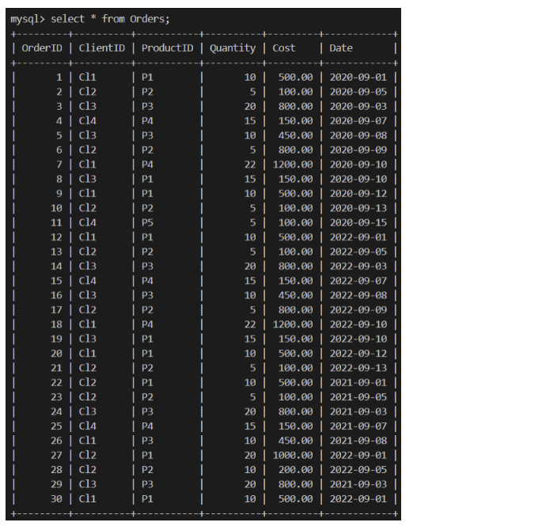

## Developing functions in MySQL

### **Lab Instructions**
Lucky Shrub needs to query their database. They can do this by using `functions` and `stored procedures` in MySQL. In this lab, you must complete a series of tasks to help Lucky Shrub staff query data from the Orders table in their database.

The Orders table contains information about the 
* Order ID, Client ID, Product ID, Quantity and Cost as shown in the following screenshot.



<br>

### **Prerequisites**
First, create the Lucky Shrub database in your MySQL environment. Then, create and populate the Orders table with the relevant data inside the Lucky Shrub database.

* Create db
```sql
CREATE DATABASE Lucky_Shrub;
```
* Make sure to use
```sql
USE Lucky_Shrub;
```
* Create Orders Table
```sql
CREATE TABLE Orders (OrderID INT NOT NULL PRIMARY KEY, ClientID VARCHAR(10), ProductID VARCHAR(10), Quantity INT, Cost DECIMAL(6,2), Date DATE); 
```
* Insert Data
```sql
INSERT INTO Orders(OrderID, ClientID, ProductID , Quantity, Cost, Date) VALUES
(1, "Cl1", "P1", 10, 500, "2020-09-01"),  
(2, "Cl2", "P2", 5, 100, "2020-09-05"),  
(3, "Cl3", "P3", 20, 800, "2020-09-03"),  
(4, "Cl4", "P4", 15, 150, "2020-09-07"),  
(5, "Cl3", "P3", 10, 450, "2020-09-08"),  
(6, "Cl2", "P2", 5, 800, "2020-09-09"),  
(7, "Cl1", "P4", 22, 1200, "2020-09-10"),  
(8, "Cl3", "P1", 15, 150, "2020-09-10"),  
(9, "Cl1", "P1", 10, 500, "2020-09-12"),  
(10, "Cl2", "P2", 5, 100, "2020-09-13"),  
(11, "Cl4", "P5", 5, 100, "2020-09-15"), 
(12, "Cl1", "P1", 10, 500, "2022-09-01"),  
(13, "Cl2", "P2", 5, 100, "2022-09-05"),  
(14, "Cl3", "P3", 20, 800, "2022-09-03"),  
(15, "Cl4", "P4", 15, 150, "2022-09-07"),  
(16, "Cl3", "P3", 10, 450, "2022-09-08"),  
(17, "Cl2", "P2", 5, 800, "2022-09-09"),  
(18, "Cl1", "P4", 22, 1200, "2022-09-10"),  
(19, "Cl3", "P1", 15, 150, "2022-09-10"),  
(20, "Cl1", "P1", 10, 500, "2022-09-12"),  
(21, "Cl2", "P2", 5, 100, "2022-09-13"),   
(22, "Cl2", "P1", 10, 500, "2021-09-01"),  
(23, "Cl2", "P2", 5, 100, "2021-09-05"),  
(24, "Cl3", "P3", 20, 800, "2021-09-03"),  
(25, "Cl4", "P4", 15, 150, "2021-09-07"),  
(26, "Cl1", "P3", 10, 450, "2021-09-08"),  
(27, "Cl2", "P1", 20, 1000, "2022-09-01"),  
(28, "Cl2", "P2", 10, 200, "2022-09-05"),  
(29, "Cl3", "P3", 20, 800, "2021-09-03"),  
(30, "Cl1", "P1", 10, 500, "2022-09-01");
```
* ... we'll need to alter the DECIMAL `Cost` Column
```sql
ALTER TABLE Orders MODIFY COLUMN Cost DECIMAL(6,2) NOT NULL;
```
* Alright the Insertion worked now after the modification

<br>

#### Objectives 
* Develop a user defined function
* Develop a stored procedure

---

<br>

### **Tasks**
**1.** Create a `SQL function` that prints the cost value of a specific order based on the user input of the `OrderID`. 
* The expected output for OrderID = 5 is 450
```sql
-- Set Function with name and argument_name, type
CREATE FUNCTION FindCost_Again(order_id INT) 
-- Detail Return type and keyword for consistent return (just seems like syntax thing )
RETURNS DECIMAL (6,2) DETERMINISTIC 
-- Value returns the single value from the SELECT statement alone (requires parentheses)
RETURN (SELECT Cost FROM Orders WHERE OrderID = order_id);

-- Now Invoke - Remember SELECT
SELECT FindCost(5);
```
| FindCost(5) |
|-------------|
|      450.00 |

<br>

**2.** Create a stored procedure called `GetDiscount`. This stored procedure must return the final cost of the customer's order after the discount value has been deducted. 

The discount value is based on the order's quantity. The stored procedure must have the following specifications: 
* The procedure should take one parameter that accepts a user input value of an OrderID. 
* The procedure must find the order quantity of the specific OrderID. 
* If the value of the order quantity is more than or equal to 20 then the procedure should return the new cost after a 20% discount. 
* If the value of the order quantity is less than 20 and more than or equal to 10 then the procedure should return the new cost after a 10% discount.
* Should the order quantiy of at least 10 not be reached, do not set a discount

The expected output result should be **405.00** with an **OrderID = 5**

* A point of emphasis to remember is after each declaration, selection or set statement, a semi-colon is added to signify the end of that particular point
```sql
-- Set Delimiter for following Procedure
DELIMITER // 
CREATE Procedure GetDiscount(OrderIDInput INT) 
     BEGIN
     -- Declare variables for conditional setting below 
         DECLARE cost_after_discount DECIMAL(7,2); 
         DECLARE current_cost DECIMAL(7,2); 
         DECLARE order_quantity INT; 
         -- WITH INTO we are assigning the declared variables above the return from the two select statements based on the received order when the procedure is invoked
         SELECT Quantity INTO order_quantity FROM Orders WHERE OrderID = OrderIDInput; 
         SELECT Cost INTO current_cost FROM Orders WHERE OrderID = OrderIDInput; 
        IF order_quantity >= 20 THEN
        -- Set value to 20% for cost_after_discount as quantity greater than or equal to 20
          SET cost_after_discount = current_cost - (current_cost * 0.2);              
        ELSEIF (order_quantity >= 10) THEN
          SET cost_after_discount = current_cost - (current_cost * 0.1); 
        ELSE SET cost_after_discount = current_cost;
        END IF;
    SELECT cost_after_discount; 
END//

DELIMITER ; 

CALL GetDiscount(5);
```
| cost_after_discount |
|---------------------|
|              405.00 |
