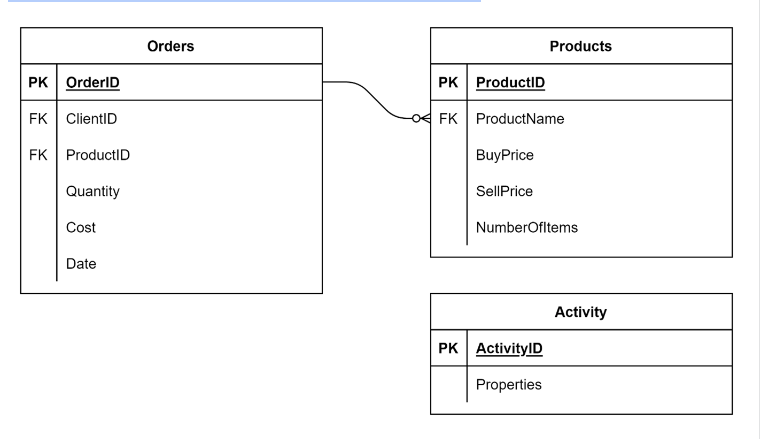

## MySQL optimization techniques exercise


#### **Lab Scenario**
Lucky Shrub need to perform a series of queries on the data in the tables in their database. The tables they need to query are the `Orders`, `Products` and `Activity` tables. An overview of these tables is shown in the following ER diagram. Lucky Shrub need your help to optimize their queries so that they can extract the data they need quickly and efficiently.  



<br>

`Environment Creation`
```sql
-- CREATE DB
CREATE DATABASE IF NOT EXISTS Lucky_Shrub;

-- USE DB
USE Lucky_Shrub;

-- Create DB Tables
CREATE TABLE IF NOT EXISTS Orders (OrderID INT NOT NULL PRIMARY KEY, ClientID VARCHAR(10), ProductID VARCHAR(10), Quantity INT, Cost DECIMAL(6,2), Date DATE);
CREATE TABLE IF NOT EXISTS Products (ProductID VARCHAR(10), ProductName VARCHAR(100), BuyPrice DECIMAL(6,2), SellPrice DECIMAL(6,2), NumberOfItems INT);
CREATE TABLE IF NOT EXISTS Activity (ActivityID INT PRIMARY KEY, Properties JSON ); 

-- Populate Tables
INSERT INTO Orders (OrderID, ClientID, ProductID , Quantity, Cost, Date) VALUES 
(1, "Cl1", "P1", 10, 500, "2020-09-01" ), 
(2, "Cl2", "P2", 5, 100, "2020-09-05"), 
(3, "Cl3", "P3", 20, 800, "2020-09-03"), 
(4, "Cl4", "P4", 15, 150, "2020-09-07"), 
(5, "Cl3", "P3", 10, 450, "2020-09-08"), 
(6, "Cl2", "P2", 5, 800, "2020-09-09"), 
(7, "Cl1", "P4", 22, 1200, "2020-09-10"), 
(8, "Cl3", "P1", 15, 150, "2020-09-10"), 
(9, "Cl1", "P1", 10, 500, "2020-09-12"), 
(10, "Cl2", "P2", 5, 100, "2020-09-13"), 
(11, "Cl4", "P5", 5, 100, "2020-09-15"),
(12, "Cl1", "P1", 10, 500, "2022-09-01"), 
(13, "Cl2", "P2", 5, 100, "2022-09-05"), 
(14, "Cl3", "P3", 20, 800, "2022-09-03"), 
(15, "Cl4", "P4", 15, 150, "2022-09-07"), 
(16, "Cl3", "P3", 10, 450, "2022-09-08"), 
(17, "Cl2", "P2", 5, 800, "2022-09-09"), 
(18, "Cl1", "P4", 22, 1200, "2022-09-10"), 
(19, "Cl3", "P1", 15, 150, "2022-09-10"), 
(20, "Cl1", "P1", 10, 500, "2022-09-12"), 
(21, "Cl2", "P2", 5, 100, "2022-09-13"),  
(22, "Cl2", "P1", 10, 500, "2021-09-01"), 
(23, "Cl2", "P2", 5, 100, "2021-09-05"), 
(24, "Cl3", "P3", 20, 800, "2021-09-03"), 
(25, "Cl4", "P4", 15, 150, "2021-09-07"), 
(26, "Cl1", "P3", 10, 450, "2021-09-08"), 
(27, "Cl2", "P1", 20, 1000, "2022-09-01"), 
(28, "Cl2", "P2", 10, 200, "2022-09-05"), 
(29, "Cl3", "P3", 20, 800, "2021-09-03"), 
(30, "Cl1", "P1", 10, 500, "2022-09-01"); 

INSERT INTO Products (ProductID, ProductName, BuyPrice, SellPrice, NumberOfItems) VALUES 
("P1", "Artificial grass bags ", 40, 50, 100), 
("P2", "Wood panels", 15, 20, 250), 
("P3", "Patio slates",  35, 40, 60), 
("P4", "Sycamore trees ", 7, 10, 50), 
("P5", "Trees and Shrubs", 35, 50, 75), 
("P6", "Water fountain", 65, 80, 15);

INSERT INTO Activity(ActivityID, Properties) VALUES  
(1, '{ "ClientID": "Cl1", "ProductID": "P1", "Order": "True" }' ),  
(2, '{ "ClientID": "Cl2", "ProductID": "P4", "Order": "False" }' ),  
(3, '{ "ClientID": "Cl5", "ProductID": "P5", "Order": "True" }' );
```

<br>

#### There are three main `objectives` in this activity: 
* Use common table expressions
* Create a prepared statement
* Use JSON to extract relevant data

---

<br>

### **Task Instructions**
**1.** - Lucky Shrub need to find out how many orders were placed by clients with the following Client IDs in 2022; Cl1, Cl2 and Cl3. Use a CTE for easier understanding and comprehending optimization.
```sql
SELECT CONCAT("Cl1: ", COUNT(OrderID), "orders") AS "Total number of orders" FROM Orders WHERE YEAR(Date) = 2022 AND ClientID = "Cl1" UNION SELECT CONCAT("Cl2: ", COUNT(OrderID), "orders") FROM Orders WHERE YEAR(Date) = 2022 AND ClientID = "Cl2" UNION SELECT CONCAT("Cl3: ", COUNT(OrderID), "orders") FROM Orders WHERE YEAR(Date) = 2022 AND ClientID = "Cl3"; 

-- CTE
WITH cl1_2022_Orders AS (
    SELECT 
        CONCAT("CL1: ", COUNT(OrderID), ' total orders') AS Cl_Orders
    FROM Orders
    WHERE YEAR(Date) = 2022
    AND ClientID = 'Cl1'
), 
cl2_2022_Orders AS (
    SELECT 
        CONCAT("CL2: ", COUNT(OrderID), ' total orders') AS Cl_Orders
    FROM Orders
    WHERE YEAR(Date) = 2022
    AND ClientID = 'Cl2'
), 
cl3_2022_Orders AS (
    SELECT 
        CONCAT("CL2: ", COUNT(OrderID), ' total orders') AS Cl_Orders
    FROM Orders
    WHERE YEAR(Date) = 2022
    AND ClientID = 'Cl3'
)
SELECT * 
FROM cl1_2022_Orders
UNION
SELECT * 
FROM cl2_2022_Orders
UNION
SELECT * 
FROM cl3_2022_Orders;
```
| Cl_Orders           |
|---------------------|
| CL1: 4 total orders |
| CL2: 5 total orders |
| CL2: 3 total orders |

<br>

**2.** Lucky Shrub need you to help them to create a prepared statement called `GetOrderDetail`. The prepared statement should accept two input arguments: a `ClientID` value and a `year` value. The statement should return the **order id**, the **quantity**, the **order cost** and the **order date** from the `Orders` table.
```sql
-- Create Prepared Statement
PREPARE GetOrderDetail FROM 'SELECT OrderID, Quantity, Cost, Date FROM Orders WHERE ClientID = ? AND YEAR(Date) = ?';

-- Set Arguments
SET @client_id = 'Cl4';
SET @date_arg = 2022;

-- Execute Prepared Statement (multiple args just passed with a comma similar to function call)
EXECUTE GetOrderDetail USING @client_id, @date_arg;
```
| OrderID | Quantity | Cost   | Date       |
|--------|----------|--------|------------|
|      15 |       15 | 150.00 | 2022-09-07 |

* Let's validate with a quick SELECT statment to confirm the results
```sql
SELECT * FROM Orders WHERE ClientID = 'Cl4' AND YEAR(Date) = 2022;
```
| OrderID | ClientID | ProductID | Quantity | Cost   | Date       |
|---------|----------|-----------|----------|--------|------------|
|      15 | Cl4      | P4        |       15 | 150.00 | 2022-09-07 |

<br>

**3.** The Lucky Shrub system logs the ClientID of each client, and the ProductID of the products they order, in a JSON Properties column in the Activity table.
* You need to utilize the Properties column data to output the product id, name, buy price and sell price of the product where the Order value in the Activity table is True.
```sql
-- Basic Query No Join with conditional case statement for JSON property
SELECT
    CONCAT('Unique product : ', Properties->'$.ProductID', ' was ',
    CASE
    -- ends with true or True
        WHEN Properties->'$.Order' LIKE '%_rue%' THEN 'ordered'
        ELSE 'not ordered'
    END, ' by : ', Properties->'$.ClientID') AS Activity_Detail
FROM Activity;
```
| Activity_Detail                                  |
|--------------------------------------------------|
| Unique product : "P1" was ordered by : "Cl1"     |
| Unique product : "P4" was not ordered by : "Cl2" |
| Unique product : "P5" was ordered by : "Cl5"     |

```sql
-- notice the slight differenceon string generation for property access a few ways 
SELECT 
    Act.Properties ->>'$. ProductID' AS ProductID,
    prdcts.ProductName, prdcts.BuyPrice, prdcts.SellPrice
FROM Activity AS Act
INNER JOIN Products AS prdcts
    ON Act.Properties ->>'$. ProductID' = prdcts.ProductID
WHERE Act.Properties->'$.Order' LIKE '%_rue%'
ORDER BY ProductID;
```
| ProductID | ProductName            | BuyPrice | SellPrice |
|-----------|------------------------|----------|-----------|
| P1        | Artificial grass bags  |    40.00 |     50.00 |
| P5        | Trees and Shrubs       |    35.00 |     50.00 |
