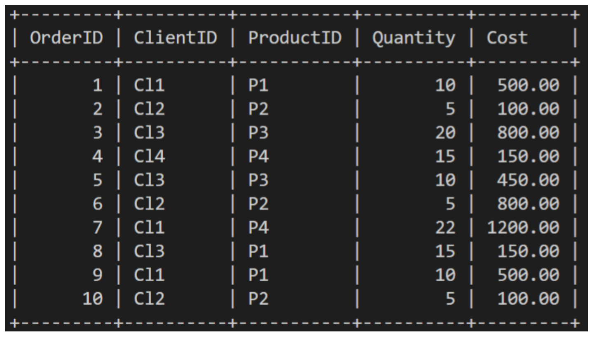

## Lab Instructions

**Lucky Shrub** is a medium-sized garden design firm that sells indoor and outdoor plants, making them a one stop shop for clients. In this lab, you are going to complete the following tasks to make it easier for Lucky Shrub staff to print relevant order data on the screen.

The `Orders` table contains information about the following columns
* Order ID, Client ID, Product ID, Quantity and Cost as shown below.



<br>

### **PreReqs**

<br>

1. Create Database
```sql
CREATE DATABASE IF NOT EXISTS Lucky_Shrub
```
2. Use Database
```sql
USE Lucky_Shrub;
```
3. Create Orders Table
```sql
CREATE TABLE Orders (OrderID INT NOT NULL PRIMARY KEY, ClientID VARCHAR(10), ProductID VARCHAR(10), Quantity INT, Cost DECIMAL(6, 2))
```
4. Insert Data
```sql
INSERT INTO Orders (OrderID, ClientID, ProductID , Quantity, Cost) VALUES (1, "Cl1", "P1", 10, 500), (2, "Cl2", "P2", 5, 100), (3, "Cl3", "P3", 20, 800), (4, "Cl4", "P4", 15, 150), (5, "Cl3", "P3", 10, 450), (6, "Cl2", "P2", 5, 800), (7, "Cl1", "P4", 22, 1200), (8, "Cl3", "P1", 15, 150), (9, "Cl1", "P1", 10, 500), (10, "Cl2", "P2", 5, 100);
```

<br>

### **Tasks Instructions**
Please attempt the following tasks:

**1.** Write a SQL statement to print all records of orders where the cost is $250 or less.
```sql
SELECT * FROM Orders WHERE Cost <= 250;
```
| OrderID | ClientID | ProductID | Quantity | Cost   |
|-----|-----|-----|-----|-----|
|       2 | Cl2      | P2        |        5 | 100.00 |
|       4 | Cl4      | P4        |       15 | 150.00 |
|       8 | Cl3      | P1        |       15 | 150.00 |
|      10 | Cl2      | P2        |        5 | 100.00 |

<br>

**2.** Write a SQL statement to print all records of orders where the cost is between $50 and $750. 
```sql
SELECT * FROM Orders WHERE Cost BETWEEN 50 AND 750 ORDER BY Cost;
```
| OrderID | ClientID | ProductID | Quantity | Cost   |
|---------|----------|-----------|----------|--------|
|       2 | Cl2      | P2        |        5 | 100.00 |
|      10 | Cl2      | P2        |        5 | 100.00 |
|       4 | Cl4      | P4        |       15 | 150.00 |
|       8 | Cl3      | P1        |       15 | 150.00 |
|       5 | Cl3      | P3        |       10 | 450.00 |
|       1 | Cl1      | P1        |       10 | 500.00 |
|       9 | Cl1      | P1        |       10 | 500.00 |

<br>

**3.** Write a SQL statement to print all records of orders that have been placed by the client with the id of Cl3 and where the cost of the order is more than $100.
```sql
SELECT * FROM Orders WHERE ClientID = 'Cl3' AND Cost > 100;
```

| OrderID | ClientID | ProductID | Quantity | Cost   |
|---------|----------|-----------|----------|--------|
|       3 | Cl3      | P3        |       20 | 800.00 |
|       5 | Cl3      | P3        |       10 | 450.00 |
|       8 | Cl3      | P1        |       15 | 150.00 |

<br>

**4.** Write a SQL statement to print all records of orders that have a product id of p1 or p2 and the order quantity is more than 2.
```sql
SELECT * FROM Orders WHERE ProductID IN ('P1', 'P2') AND Quantity >= 2;
```

| OrderID | ClientID | ProductID | Quantity | Cost   |
|---------|----------|-----------|----------|--------|
|       1 | Cl1      | P1        |       10 | 500.00 |
|       2 | Cl2      | P2        |        5 | 100.00 |
|       6 | Cl2      | P2        |        5 | 800.00 |
|       8 | Cl3      | P1        |       15 | 150.00 |
|       9 | Cl1      | P1        |       10 | 500.00 |
|      10 | Cl2      | P2        |        5 | 100.00 |
