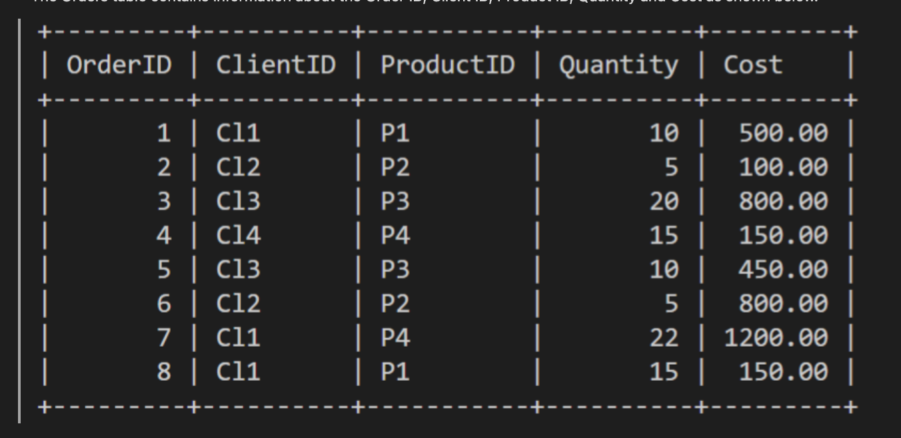

## MYSQL REPLACE LAB
Lab Instructions
Lucky Shrub is a medium-sized garden design firm that sells indoor and outdoor plants, making them a one stop shop for clients. In this lab, you must complete the following tasks to make it easier for Lucky Shrub to insert and update data in the Orders table using the REPLACE statement.

The Orders table contains information about the Order ID, Client ID, Product ID, Quantity and Cost as shown below.



<br>

#### **Prerequisites**
To complete this lab, you must have the Lucky Shrub database created in MySQL. You must also have created and populate the Orders table with relevant data inside the Lucky Shrub database.

The code to create the database and the Orders table is as follows:

1. Create database
```sql
CREATE DATABASE IF NOT EXISTS Lucky_Shrub;
```
2. Use Database
```sql
USE Lucky_Shrub;
```
3. Create Orders Table
```sql
CREATE TABLE Orders (OrderID INT NOT NULL PRIMARY KEY, ClientID VARCHAR(10), ProductID VARCHAR(10), Quantity INT, Cost DECIMAL(6, 2));
```
4. Insert Data
```sql
INSERT INTO Orders (OrderID, ClientID, ProductID, Quantity, Cost) VALUES (1, "Cl1", "P1", 10, 500), (2, "Cl2", "P2", 5, 100), (3, "Cl3", "P3", 20, 800), (4, "Cl4", "P4", 15, 150), (5, "Cl3", "P3", 10, 450), (6, "Cl2", "P2", 5, 800), (7, "Cl1", "P4", 22, 1200), (8, "Cl1", "P1", 15, 150);  
```

<br>

#### **There are two main objectives in this activity** 
* Insert new records of data using the REPLACE statement.
* Update records with new data using the REPLACE statement.


| OrderID | ClientID | ProductID | Quantity | Cost    |
|---------|----------|-----------|----------|---------|
|       1 | Cl1      | P1        |       10 |  500.00 |
|       2 | Cl2      | P2        |        5 |  100.00 |
|       3 | Cl3      | P3        |       20 |  800.00 |
|       4 | Cl4      | P4        |       15 |  150.00 |
|       5 | Cl3      | P3        |       10 |  450.00 |
|       6 | Cl2      | P2        |        5 |  800.00 |
|       7 | Cl1      | P4        |       22 | 1200.00 |
|       8 | Cl1      | P1        |       15 |  150.00 |


<br>

#### **Tasks**
1. Write a SQL REPLACE statement that inserts two new orders with the following details:

Order 9 data:
* OrderID = 9, ClientID = "Cl1", ProductID = "P1", Quantity = 10, Cost = 5000

Order 10 data:
* OrderID = 10, ClientID = "Cl2", ProductID = "P2", Quantity = 5, Cost = 100

```sql
REPLACE INTO Orders (OrderID, ClientID, ProductID, Quantity, Cost) VALUES (9, 'CLI1', 'P1', 10, 5000.00), (10, 'CL2', 'P2', 5, 100.00);
```
| OrderID | ClientID | ProductID | Quantity | Cost    |
|---------|----------|-----------|----------|---------|
|       1 | Cl1      | P1        |       10 |  500.00 |
|       2 | Cl2      | P2        |        5 |  100.00 |
|       3 | Cl3      | P3        |       20 |  800.00 |
|       4 | Cl4      | P4        |       15 |  150.00 |
|       5 | Cl3      | P3        |       10 |  450.00 |
|       6 | Cl2      | P2        |        5 |  800.00 |
|       7 | Cl1      | P4        |       22 | 1200.00 |
|       8 | Cl1      | P1        |       15 |  150.00 |
|       9 | CLI1     | P1        |       10 | 5000.00 |
|      10 | CL2      | P2        |        5 |  100.00 |

10 rows in set (0.00 sec)

<br>

2. Lucky Shrub have noticed that the cost of order number 9 is 5000$. This is a mistake. The order must cost 500$. You must help them to change it to 500$ by writing a relevant REPLACE statement. Once you have executed the SQL statement, select all available data from the Orders table.
* **Note** : All values want to be included for row item to not unset values to `null` if no default values exists for the column 
```SQL
REPLACE INTO Orders SET OrderID = 9, ClientID = "Cl1", ProductID = "P1", Quantity = 10;
```
| OrderID | ClientID | ProductID | Quantity | Cost    |
|---------|----------|-----------|----------|---------|
|       9 | Cl1      | P1        |       10 |    NULL |

```sql
REPLACE INTO Orders SET OrderID = 9, ClientID = "Cl1", ProductID = "P1", Quantity = 10, Cost = 500;
```
| OrderID | ClientID | ProductID | Quantity | Cost   |
|---------|----------|-----------|----------|--------|
|       9 | Cl1      | P1        |       10 | 500.00 |