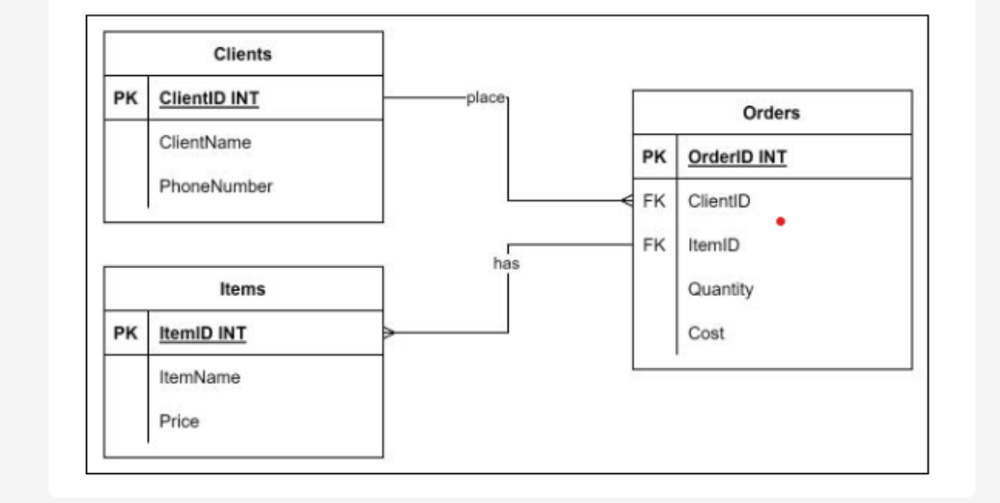

## Constraints

### Lab Instructions
Mangata and Gallo is a jewelry store that specializes in special occasions like engagements, weddings and anniversaries. The jewelry company primarily operates online and has a small storefront in Austin, Texas with an atelier attached for browsing. 
* The company approached you to create three tables for their database called `'Clients'`, `'Orders'` and `'Items'` respectively. 
* Each database must have all necessary constraints applied as specified in each task.

#### `Constraints`
* The 'Clients' table contains the Client ID, full name and phone number of each client.

* The Orders table contains information about each order's Order ID, Client ID, Product ID, and Cost.

* The Items table contains information about the Item ID, Item name, and Item price.

The relationship between the three table is illustrated in the following entity relationship diagram (ER-D).


---

<br>

### **Prerequisites** - Environment Setup
1. Create Database
```sql
CREATE DATABASE Mangata_Gallo; 
```
2. Use Database
```sql
USE Mangata_Gallo; 
```

<br>

#### **Exercise Tasks**
1. Create the Clients table with the following constraints.
    * ClientID: INT, NOT NULL and PRIMARY KEY
    * FullName: VARCHAR(100) NOT NULL
    * PhoneNumber: INT, NOT NULL and UNIQUE
```sql
CREATE TABLE Clients (ClientID INT NOT NULL PRIMARY KEY, FullName VARCHAR(50) NOT NULL, PhoneNumber INT NOT NULL UNIQUE);
```
2.  Create the Items table with the following attributes and constraints:
    * ItemID: INT, NOT NULL and PRIMARY KEY
    * ItemName: VARCHAR(100) and NOT NULL
    * Price: Decimal(5,2) and NOT NULL
```sql
CREATE TABLE Items (ItemID INT NOT NULL PRIMARY KEY, ItemName VARCHAR(100) NOT NULL, Price Decimal(5,2) NOT NULL);
```
3. Create the Orders table with the following constraints.
    * OrderID: INT, NOT NULL and PRIMARY KEY
    * ClientID: INT, NOT NULL and FOREIGN KEY
    * ItemID: INT, NOT NULL and FOREIGN KEY
    * Quantity: INT, NOT NULL and maximum allowed items in each order 3 only
    * COST Decimal(6,2) and NOT NULL
```sql
CREATE TABLE Orders (OrderID INT NOT NULL PRIMARY KEY, ClientID INT NOT NULL, ItemID INT NOT NULL, Quantity INT NOT NULL CHECK(Quantity <=3), COST Decimal(6,2) NOT NULL, FOREIGN KEY (ClientID) REFERENCES Clients(ClientID), FOREIGN KEY (ItemID) REFERENCES Items(ItemID));
```

<br>

### `Tables Column Outlook` w/Constraints and Key detail

<br>

```sql
SHOW COLUMNS FROM Clients;
```

| Field       | Type        | Null | Key | Default | Extra |
|-------------|-------------|------|-----|---------|-------|
| ClientID    | int         | NO   | PRI | NULL    |       |
| FullName    | varchar(50) | NO   |     | NULL    |       |
| PhoneNumber | int         | NO   | UNI | NULL    |       |

<br>


```sql
SHOW COLUMNS FROM Items;
```
| Field    | Type         | Null | Key | Default | Extra |
|----------|--------------|------|-----|---------|-------|
| ItemID   | int          | NO   | PRI | NULL    |       |
| ItemName | varchar(100) | NO   |     | NULL    |       |
| Price    | decimal(5,2) | NO   |     | NULL    |       |

<br>

```sql
SHOW COLUMNS FROM Orders;
```
| Field    | Type         | Null | Key | Default | Extra |
|----------|--------------|------|-----|---------|-------|
| OrderID  | int          | NO   | PRI | NULL    |       |
| ClientID | int          | NO   | MUL | NULL    |       |
| ItemID   | int          | NO   | MUL | NULL    |       |
| Quantity | int          | NO   |     | NULL    |       |
| COST     | decimal(6,2) | NO   |     | NULL    |       |

---

<br>

### Subsequent Exercise
* Here we can look at the usage of `CASCADE`

#### **Tasks**
1. Create the Staff table with the following PRIMARY KEY and NOT NULL constraints:
    * Staff ID should be INT, NOT NULL and PRIMARY KEY
    * PhoneNumber should be INT, NOT NULL and UNIQUE 
    * FullName: VARCHAR(100) NOT NULL.
```sql
CREATE TABLE Staff (StaffID INT NOT NULL PRIMARY KEY, PhoneNumber INT NOT NULL UNIQUE, FullName VARCHAR(100) NOT NULL);
```

<br>

2. Create the 'ContractInfo' table with the following key and domain constraints:
    * Contract ID should be INT, NOT NULL and PRIMARY KEY
    * StaffID should be INT, NOT NULL. 
    * Salary should be DECIMAL (7,2), NOT NULL.
    * Location should be VARCHAR (50) NOT NULL with DEFAULT = "Texas". 
    * StaffType should be VARCHAR (20) NOT NULL and should accept a "Junior" or a "Senior" value.

<br>

3. Create a foreign key that links the Staff table with the ContractInfo table. In this example, you need to apply the referential integrity rule as follows:
    * Link each member of staff in the Staff table to a specific contract in the Contract Info table. 
    * Each staff ID existing in the 'Contract Info' table is expected to exist as well in the Staff table. 
    * The staff ID in the 'Contract Info' table should be defined as a foreign key to reference the Staff ID in the Staff table.
```sql
CREATE TABLE ContractInfo (ContractID INT NOT NULL PRIMARY KEY, StaffID INT NOT NULL, Salary DECIMAL(7,2) NOT NULL, Location VARCHAR(50) NOT NULL DEFAULT 'Texas', StaffType VARCHAR(20) NOT NULL CHECK(StaffType = 'Junior' OR Stafftype = 'Senior'), FOREIGN KEY StaffID REFERENCES Staff(StaffID) ON DELETE CASCADE ON UPDATE CASCADE);
```